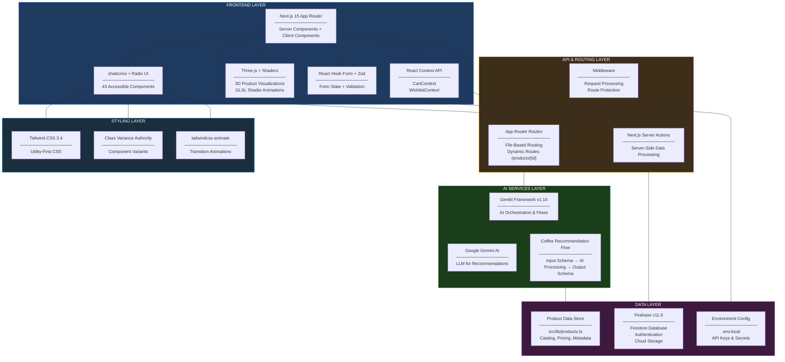

<div align="center">

# Artisan Lane

### A Modern E-Commerce Platform for Artisan Coffee


**Artisan Lane** is a full-featured, production-ready e-commerce web application crafted for artisan coffee enthusiasts. Built with **Next.js 15 App Router**, **TypeScript**, and **Tailwind CSS**, it delivers a premium shopping experience with **AI-powered recommendations**, **3D product visualizations**, and a fully **responsive, accessible** interface.

---

[Features](#-features) | [System Architecture](#-system-architecture) | [Tech Stack](#-technology-stack) | [Getting Started](#-getting-started) | [Configuration](#-configuration) | [Project Structure](#-project-structure)

</div>

---

## Table of Contents

- [Features](#-features)
  - [E-Commerce Core](#e-commerce-core)
  - [AI-Powered Intelligence](#ai-powered-intelligence)
  - [User Experience](#user-experience)
  - [Pages & Navigation](#pages--navigation)
- [System Architecture](#-system-architecture)
- [Technology Stack](#-technology-stack)
- [Project Statistics](#-project-statistics)
- [Getting Started](#-getting-started)
  - [Prerequisites](#prerequisites)
  - [Installation](#installation)
  - [Development Server](#development-server)
  - [Available Scripts](#available-scripts)
- [Configuration](#-configuration)
  - [Next.js Configuration](#nextjs-configuration)
  - [Tailwind CSS Configuration](#tailwind-css-configuration)
  - [TypeScript Configuration](#typescript-configuration)
  - [Shadcn/ui Configuration](#shadcnui-configuration)
  - [Environment Variables](#environment-variables)
- [Project Structure](#-project-structure)
- [Key Highlights](#-key-highlights)
- [License](#license)
- [Support](#support)

---

## Features

### E-Commerce Core

- **Product Catalog** -- Browse a curated collection of artisan coffee products with category-based filtering and sorting
- **Product Detail Pages** -- Rich product pages with specifications, images, pricing, and related product suggestions
- **Shopping Cart** -- Full cart management with add, remove, and quantity adjustment capabilities; persistent across sessions via React Context
- **Wishlist** -- Save favorite products for later; move items seamlessly between wishlist and cart
- **Product Cards** -- Interactive cards with hover effects, quick-add to cart/wishlist actions, and real-time state updates

### AI-Powered Intelligence

- **Smart Coffee Recommendations** -- Powered by **Google Gemini AI** via the **Genkit** framework; generates personalized coffee suggestions based on user preferences
- **Recommendation Form** -- Interactive questionnaire capturing taste preferences, roast level, origin, and brewing method
- **AI Flow Pipeline** -- Structured Genkit flows with input/output schemas for type-safe AI orchestration
- **Genkit Dev Server** -- Dedicated development environment for testing and iterating on AI flows

### User Experience

- **Responsive Design** -- Mobile-first approach ensuring seamless experience across all screen sizes and devices
- **Accessibility (WCAG)** -- Built on Radix UI primitives guaranteeing keyboard navigation, screen reader support, and ARIA compliance
- **3D Visualizations** -- Interactive product visualizations powered by **Three.js** with WebGL rendering
- **Shader Animations** -- Custom GLSL shader-based background animations for immersive visual effects
- **Toast Notifications** -- Real-time feedback system for cart updates, wishlist actions, and form submissions
- **Loading States** -- Skeleton loaders, dot loaders, and progress indicators for smooth perceived performance
- **Dark Mode Support** -- CSS-variable-based theming with class-based dark mode toggle capability
- **Form Validation** -- Robust form handling with **React Hook Form** + **Zod** schema validation

### Pages & Navigation

| Page | Route | Description |
|------|-------|-------------|
| **Home** | `/` | Landing page with hero section, featured products, and curated coffee categories |
| **Products** | `/products` | Full product catalog with filtering and sorting |
| **Product Detail** | `/products/[id]` | Individual product page with specifications and actions |
| **Cart** | `/cart` | Shopping cart with item management and checkout summary |
| **Wishlist** | `/wishlist` | Saved items with move-to-cart and remove functionality |
| **AI Recommend** | `/recommend` | AI-powered coffee recommendation engine |
| **About** | `/about` | Brand story, mission, and values |
| **Contact** | `/contact` | Contact form for inquiries |
| **FAQ** | `/faq` | Frequently asked questions with accordion layout |
| **Account** | `/account` | User profile and account management |
| **Privacy** | `/privacy` | Privacy policy and data handling information |
| **Terms** | `/terms` | Terms of service and usage conditions |

---

## System Architecture



---

## Technology Stack

### **Core Framework**

| Technology | Version | Purpose |
|------------|---------|---------|
| **Next.js** | `15.3.3` | React meta-framework with App Router, Server Components, and Turbopack |
| **React** | `^18.3.1` | UI library for building component-based interfaces |
| **React DOM** | `^18.3.1` | React rendering for web browsers |
| **TypeScript** | `^5` | Static type checking with strict mode enabled |

### **Styling & UI Components**

| Technology | Version | Purpose |
|------------|---------|---------|
| **Tailwind CSS** | `^3.4.1` | Utility-first CSS framework with custom theme |
| **tailwindcss-animate** | `^1.0.7` | Animation utilities for Tailwind |
| **tailwind-merge** | `^3.0.1` | Intelligent Tailwind class merging |
| **class-variance-authority** | `^0.7.1` | Type-safe component variant management |
| **clsx** | `^2.1.1` | Conditional className utility |
| **shadcn/ui** | Latest | 43 pre-built accessible components |
| **Radix UI** | Various | 20+ headless UI primitives |
| **Lucide React** | `^0.475.0` | Beautiful, consistent icon library |

### **State Management & Forms**

| Technology | Version | Purpose |
|------------|---------|---------|
| **React Context API** | Built-in | Global state for Cart and Wishlist |
| **React Hook Form** | `^7.54.2` | Performant form state management |
| **@hookform/resolvers** | `^4.1.3` | Schema validation integration |
| **Zod** | `^3.24.2` | TypeScript-first schema validation |

### **AI & Backend Services**

| Technology | Version | Purpose |
|------------|---------|---------|
| **Genkit** | `^1.14.1` | AI orchestration framework by Google |
| **@genkit-ai/googleai** | `^1.14.1` | Google AI provider for Genkit |
| **@genkit-ai/next** | `^1.14.1` | Next.js integration for Genkit |
| **genkit-cli** | `^1.14.1` | CLI tools for Genkit development |
| **Google Gemini AI** | - | LLM powering recommendation engine |
| **Firebase** | `^11.9.1` | Backend-as-a-Service (Firestore, Auth, Storage) |

### **3D Graphics & Visualization**

| Technology | Version | Purpose |
|------------|---------|---------|
| **Three.js** | `^0.167.0` | WebGL-based 3D rendering engine |
| **@types/three** | `^0.167.1` | TypeScript definitions for Three.js |
| **Recharts** | `^2.15.1` | Composable charting library for React |

### **Utilities & Carousels**

| Technology | Version | Purpose |
|------------|---------|---------|
| **date-fns** | `^3.6.0` | Modern JavaScript date utility library |
| **embla-carousel-react** | `^8.6.0` | Extensible carousel engine |
| **react-day-picker** | `^8.10.1` | Flexible date picker component |
| **dotenv** | `^16.5.0` | Environment variable loader |
| **patch-package** | `^8.0.0` | Fix node_modules packages post-install |

### **Development Tools**

| Technology | Version | Purpose |
|------------|---------|---------|
| **PostCSS** | `^8` | CSS transformation pipeline |
| **ESLint** | Built-in | JavaScript/TypeScript linting |
| **Turbopack** | Bundled | Ultra-fast bundler for development |

---

## Project Statistics

| Metric | Value |
|--------|-------|
| **Version** | `0.1.0` |
| **Framework** | Next.js `15.3.3` |
| **Runtime** | React `18.3.1` |
| **Language** | TypeScript `5.x` (Strict Mode) |
| **Total Dependencies** | **46** (38 production + 8 dev) |
| **UI Components** | **43** shadcn/ui components |
| **Custom Components** | **4** application-specific |
| **Total Components** | **47** |
| **App Pages** | **12** routes |
| **AI Flows** | **1** recommendation pipeline |
| **Context Providers** | **2** (Cart + Wishlist) |
| **Custom Hooks** | **2** (use-toast, use-mobile) |
| **Radix UI Primitives** | **20** accessible components |
| **Dev Server Port** | `9002` (Turbopack) |

---

## Getting Started

### Prerequisites

Before running this project, ensure you have the following installed:

- **Node.js** `v18.x` or higher -- [Download](https://nodejs.org/)
- **npm** `v9.x` or higher (comes with Node.js) or **yarn**
- **Google AI API Key** -- Required for AI recommendations ([Get one here](https://aistudio.google.com/app/apikey))
- **Firebase Project** -- Required for backend services ([Create one](https://console.firebase.google.com/))

### Installation

```bash
# 1. Clone the repository
git clone <repository-url>

# 2. Navigate to the project directory
cd artisan-lane

# 3. Install all dependencies
npm install

# 4. Create environment configuration
cp .env.example .env.local

# 5. Edit .env.local with your API keys (see Environment Variables section)

# 6. Start the development server
npm run dev
```

### Development Server

The development server runs on **http://localhost:9002** with **Turbopack** for instant hot module replacement.

```bash
npm run dev
```

> **Note**: The app uses Turbopack (`--turbopack` flag) for significantly faster development builds compared to Webpack.

### Available Scripts

| Command | Description | Usage |
|---------|-------------|-------|
| `npm run dev` | Start development server with Turbopack on port `9002` | Local development |
| `npm run build` | Create optimized production build | Pre-deployment |
| `npm run start` | Start the production server | Production |
| `npm run lint` | Run ESLint for code quality checks | Code review |
| `npm run typecheck` | Run TypeScript compiler without emitting files | Type verification |
| `npm run genkit:dev` | Start Genkit AI development server | AI flow testing |
| `npm run genkit:watch` | Start Genkit in watch mode (auto-reload) | AI flow development |

---

## Configuration

### Next.js Configuration

**File**: `next.config.ts`

```typescript
{
  typescript: {
    ignoreBuildErrors: true,    // Skip TS errors during build
  },
  eslint: {
    ignoreDuringBuilds: true,   // Skip linting during build
  },
  images: {
    remotePatterns: [{
      protocol: 'https',
      hostname: 'images.unsplash.com',  // Allowed image domain
    }],
  },
}
```

**Key Points**:
- TypeScript and ESLint errors are ignored during production builds for faster iteration
- Remote image loading is restricted to `images.unsplash.com` for security
- Image optimization is enabled via Next.js `<Image>` component

### Tailwind CSS Configuration

**File**: `tailwind.config.ts`

- **Dark Mode**: Class-based (`darkMode: ['class']`)
- **Content Paths**: Scans `src/pages`, `src/components`, and `src/app`
- **CSS Variables**: All colors use HSL CSS variables for dynamic theming
- **Custom Fonts**: `Literata` serif for body and headline, monospace for code
- **Animations**: Custom accordion keyframes with `tailwindcss-animate` plugin
- **Border Radius**: Configurable via `--radius` CSS variable

**Color Palette**:

| Token | Purpose |
|-------|---------|
| `primary` | Main brand color |
| `secondary` | Supporting accent |
| `accent` | Highlight color |
| `destructive` | Error/danger states |
| `muted` | Subdued backgrounds |
| `card` | Card surfaces |
| `popover` | Dropdown/popover surfaces |
| `sidebar` | Sidebar-specific theming |
| `chart-1` to `chart-5` | Data visualization colors |

### TypeScript Configuration

**File**: `tsconfig.json`

- **Target**: `ES2017`
- **Strict Mode**: Enabled (`"strict": true`)
- **Module System**: ESNext with bundler resolution
- **Path Alias**: `@/*` maps to `./src/*`
- **Incremental Compilation**: Enabled for faster rebuilds
- **JSX**: Preserve (handled by Next.js)

### Shadcn/ui Configuration

**File**: `components.json`

- **Style**: `default`
- **RSC (React Server Components)**: `enabled`
- **TSX**: `enabled`
- **Base Color**: `neutral`
- **CSS Variables**: `enabled`
- **Icon Library**: `lucide`
- **Path Aliases**: `@/components`, `@/lib`, `@/hooks`, `@/components/ui`

### Environment Variables

Create a `.env.local` file in the project root with the following variables:

```env
# ===========================================
# Google AI (Gemini) Configuration
# ===========================================
# Required for AI-powered coffee recommendations
# Get your key: https://aistudio.google.com/app/apikey
GOOGLE_GENAI_API_KEY=your_google_ai_api_key_here

# ===========================================
# Firebase Configuration
# ===========================================
# Required for backend services (Firestore, Auth)
# Get these from: https://console.firebase.google.com/
NEXT_PUBLIC_FIREBASE_API_KEY=your_firebase_api_key
NEXT_PUBLIC_FIREBASE_AUTH_DOMAIN=your_project.firebaseapp.com
NEXT_PUBLIC_FIREBASE_PROJECT_ID=your_project_id
NEXT_PUBLIC_FIREBASE_STORAGE_BUCKET=your_project.appspot.com
NEXT_PUBLIC_FIREBASE_MESSAGING_SENDER_ID=your_sender_id
NEXT_PUBLIC_FIREBASE_APP_ID=your_app_id
```

> **Important**: Never commit `.env.local` to version control. It is included in `.gitignore` by default.

---

## Project Structure

```
artisan-lane/
├── src/
│   ├── app/                            # Next.js App Router (file-based routing)
│   │   ├── layout.tsx                  # Root layout with providers, fonts, metadata
│   │   ├── page.tsx                    # Home page (/)
│   │   ├── globals.css                 # Global styles + Tailwind directives
│   │   ├── products/
│   │   │   ├── page.tsx                # Product catalog (/products)
│   │   │   └── [id]/
│   │   │       └── page.tsx            # Dynamic product detail (/products/:id)
│   │   ├── cart/
│   │   │   └── page.tsx                # Shopping cart (/cart)
│   │   ├── wishlist/
│   │   │   └── page.tsx                # Wishlist (/wishlist)
│   │   ├── recommend/
│   │   │   └── page.tsx                # AI recommendation engine (/recommend)
│   │   ├── about/
│   │   │   └── page.tsx                # About page (/about)
│   │   ├── contact/
│   │   │   └── page.tsx                # Contact form (/contact)
│   │   ├── faq/
│   │   │   └── page.tsx                # FAQ accordion (/faq)
│   │   ├── account/
│   │   │   └── page.tsx                # User account (/account)
│   │   ├── privacy/
│   │   │   └── page.tsx                # Privacy policy (/privacy)
│   │   └── terms/
│   │       └── page.tsx                # Terms of service (/terms)
│   │
│   ├── components/                     # React Components
│   │   ├── Header.tsx                  # Navigation header with cart/wishlist
│   │   ├── Footer.tsx                  # Site footer with links
│   │   ├── ProductCardActions.tsx      # Cart/wishlist action buttons
│   │   ├── ProductInteractions.tsx     # Product interaction handlers
│   │   ├── RecommendationForm.tsx      # AI recommendation questionnaire
│   │   └── ui/                         # 43 shadcn/ui components
│   │       ├── accordion.tsx           # Expandable accordion
│   │       ├── alert-dialog.tsx        # Modal alert dialogs
│   │       ├── alert.tsx               # Alert banners
│   │       ├── avatar.tsx              # User avatars
│   │       ├── badge.tsx               # Status badges
│   │       ├── button.tsx              # Button variants
│   │       ├── calendar.tsx            # Date picker calendar
│   │       ├── card.tsx                # Content cards
│   │       ├── carousel.tsx            # Image carousels
│   │       ├── chart.tsx               # Data visualization
│   │       ├── checkbox.tsx            # Checkboxes
│   │       ├── collapsible.tsx         # Collapsible sections
│   │       ├── dialog.tsx              # Modal dialogs
│   │       ├── dot-loader.tsx          # Loading animation
│   │       ├── dropdown-menu.tsx       # Dropdown menus
│   │       ├── form.tsx                # Form components
│   │       ├── gradient-button.tsx     # Gradient CTA buttons
│   │       ├── input.tsx               # Text inputs
│   │       ├── label.tsx               # Form labels
│   │       ├── menubar.tsx             # Menu bars
│   │       ├── popover.tsx             # Popovers
│   │       ├── progress.tsx            # Progress bars
│   │       ├── radio-group.tsx         # Radio buttons
│   │       ├── scroll-area.tsx         # Custom scroll areas
│   │       ├── select.tsx              # Select dropdowns
│   │       ├── separator.tsx           # Visual separators
│   │       ├── shader-animation.tsx    # GLSL shader backgrounds
│   │       ├── sheet.tsx               # Slide-out panels
│   │       ├── sidebar.tsx             # Sidebar navigation
│   │       ├── skeleton.tsx            # Loading skeletons
│   │       ├── slider.tsx              # Range sliders
│   │       ├── switch.tsx              # Toggle switches
│   │       ├── table.tsx               # Data tables
│   │       ├── tabs.tsx                # Tab navigation
│   │       ├── textarea.tsx            # Text areas
│   │       ├── toast.tsx               # Toast notifications
│   │       ├── toaster.tsx             # Toast container
│   │       └── tooltip.tsx             # Tooltips
│   │
│   ├── context/                        # React Context Providers
│   │   ├── CartContext.tsx             # Shopping cart global state
│   │   └── WishlistContext.tsx         # Wishlist global state
│   │
│   ├── lib/                            # Utilities & Data
│   │   ├── utils.ts                    # Helper functions (cn, etc.)
│   │   └── products.ts                # Product catalog data
│   │
│   ├── hooks/                          # Custom React Hooks
│   │   ├── use-toast.ts               # Toast notification hook
│   │   └── use-mobile.tsx             # Mobile device detection
│   │
│   └── ai/                             # AI Services (Genkit)
│       ├── dev.ts                      # Genkit development server setup
│       ├── genkit.ts                   # Genkit configuration & initialization
│       └── flows/
│           └── coffee-recommendation.ts # AI recommendation flow
│
├── public/                             # Static Assets
├── next.config.ts                      # Next.js configuration
├── tailwind.config.ts                  # Tailwind CSS configuration
├── tsconfig.json                       # TypeScript configuration
├── components.json                     # Shadcn/ui configuration
├── postcss.config.mjs                  # PostCSS configuration
├── package.json                        # Dependencies & scripts
└── .env.local                          # Environment variables (not committed)
```

---

## Key Highlights

> **Modern Stack** -- Built on Next.js 15 with App Router, React 18, TypeScript 5, and Tailwind CSS 3.4 for a cutting-edge development experience.

> **AI-Powered** -- Genkit integration with Google Gemini AI delivers intelligent, personalized coffee recommendations through structured AI flows.

> **47 Components** -- Comprehensive UI library with 43 shadcn/ui components and 4 custom application components, all built on accessible Radix UI primitives.

> **3D Ready** -- Three.js integration enables immersive product visualizations with WebGL rendering and custom GLSL shader animations.

> **Type Safe** -- Full TypeScript coverage with strict mode, Zod schema validation, and end-to-end type safety from database to UI.

> **Production Ready** -- Optimized builds, Turbopack development server, ESLint, and TypeScript checking configured out of the box.

> **Accessible** -- WCAG-compliant components with keyboard navigation, screen reader support, and semantic HTML throughout.

> **Responsive** -- Mobile-first design ensuring seamless experience across phones, tablets, and desktops.

---

## License

**Private** -- All rights reserved.

---

## Support

For questions, issues, or feature requests, please refer to the project documentation or contact the development team.

---

<div align="center">

**Built with passion for artisan coffee**


</div>
