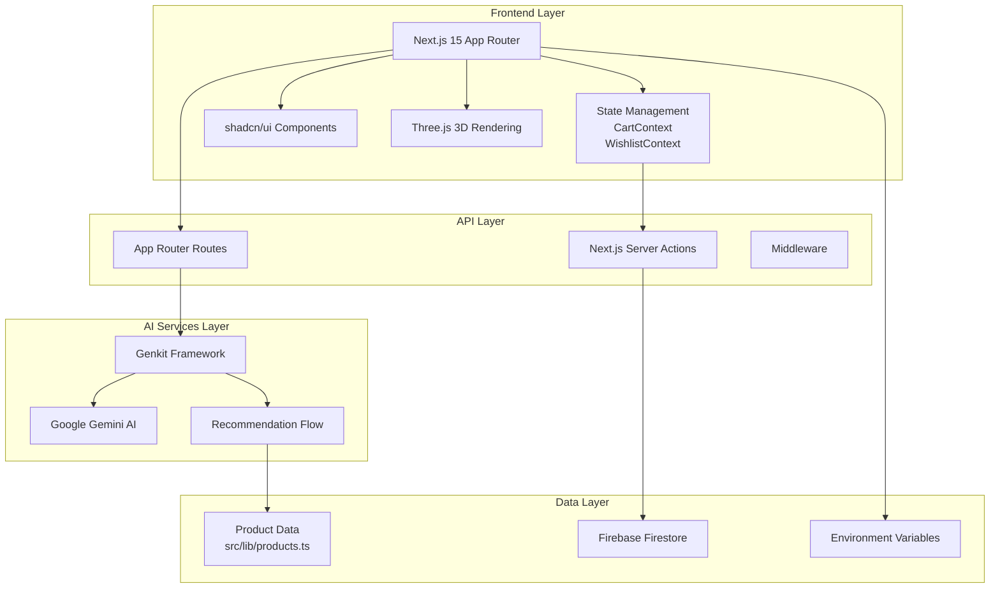

# Artisan Lane

A modern e-commerce platform for artisan coffee products built with **Next.js 15**, featuring AI-powered recommendations, 3D visualizations, and a seamless shopping experience.

---

## System Architecture



---

## Technology Stack

### **Core Framework**
- **Next.js 15.3.3** - React framework with App Router
- **React 18.3.1** - UI library
- **TypeScript 5.x** - Type safety

### **Styling & UI**
- **Tailwind CSS 3.4.1** - Utility-first CSS
- **shadcn/ui** - Component library
- **Radix UI** - Accessible primitives
- **Lucide React** - Icon library

### **State Management**
- React Context API (Cart & Wishlist)
- React Hook Form + Zod validation

### **AI & Backend**
- **Genkit 1.14.1** - AI orchestration framework
- **Google Gemini AI** - AI model for recommendations
- **Firebase 11.9.1** - Backend services

### **Additional Libraries**
- **Three.js 0.167** - 3D graphics
- **Recharts 2.15.1** - Data visualization
- **date-fns** - Date utilities

---

## Project Statistics

| Metric | Value |
|--------|-------|
| **Version** | 0.1.0 |
| **Framework** | Next.js 15.3.3 |
| **React** | 18.3.1 |
| **Language** | TypeScript |
| **Total Dependencies** | 45+ |
| **UI Components** | 30+ shadcn/ui |
| **TypeScript Config** | Strict with build error ignoring |

---

## Features

### E-Commerce
- **Product Catalog** - Browse artisan coffee products with filtering
- **Product Details** - Detailed view with specifications
- **Shopping Cart** - Add/remove items with quantity management
- **Wishlist** - Save favorite products for later

### AI-Powered
- **Smart Recommendations** - AI-driven coffee suggestions based on preferences
- **Personalized Experience** - Tailored product recommendations

### User Experience
- **Responsive Design** - Mobile-first approach
- **Accessibility** - WCAG-compliant components
- **3D Visualizations** - Interactive Three.js elements
- **Smooth Animations** - Graceful transitions and micro-interactions
- **Toast Notifications** - Real-time feedback system

### Additional Pages
- **Home** - Landing page with featured products
- **About** - Brand story and mission
- **Contact** - Get in touch form
- **FAQ** - Frequently asked questions
- **Privacy Policy** - Data handling information
- **Terms of Service** - Usage terms
- **Account** - User profile management

---

## Configuration

### Next.js Configuration (`next.config.ts`)
- TypeScript build errors ignored
- ESLint ignored during build
- Image domains: `images.unsplash.com`

### Tailwind Configuration (`tailwind.config.ts`)
- CSS variables enabled
- Custom color palette (primary, secondary, accent, destructive)
- Sidebar theme support
- Custom font families (body, headline, code)

### Shadcn/ui Configuration (`components.json`)
- **Style**: default
- **RSC**: enabled (Server Components)
- **Prefix**: none
- **Alias**: @/, @/components, @/lib, @/hooks

---

## Getting Started

### Prerequisites
- Node.js 18.x or higher
- npm or yarn
- Google AI API key (for recommendations)

### Installation

```bash
# Clone the repository
git clone <repository-url>

# Navigate to project directory
cd artisan-lane

# Install dependencies
npm install

# Set up environment variables
cp .env.example .env.local
# Edit .env.local with your API keys

# Start development server
npm run dev
```

### Development Server
Runs on **http://localhost:9002** with Turbopack

```bash
npm run dev
```

### Available Scripts

| Command | Description |
|---------|-------------|
| `npm run dev` | Start development server with Turbopack |
| `npm run build` | Build for production |
| `npm run start` | Start production server |
| `npm run lint` | Run ESLint |
| `npm run typecheck` | Run TypeScript type checking |
| `npm run genkit:dev` | Start Genkit AI development |
| `npm run genkit:watch` | Watch mode for Genkit AI |

---

## Project Structure

```
artisan-lane/
├── src/
│   ├── app/                    # Next.js App Router pages
│   │   ├── page.tsx            # Home page
│   │   ├── products/           # Product listing & details
│   │   ├── cart/               # Shopping cart
│   │   ├── wishlist/           # Saved items
│   │   ├── recommend/         # AI recommendations
│   │   ├── account/            # User account
│   │   └── ...
│   ├── components/             # React components
│   │   ├── ui/                 # shadcn/ui components
│   │   ├── Header.tsx          # Navigation header
│   │   ├── Footer.tsx          # Site footer
│   │   └── ...
│   ├── context/                # React Context providers
│   │   ├── CartContext.tsx    # Cart state management
│   │   └── WishlistContext.tsx # Wishlist state management
│   ├── lib/                    # Utilities & data
│   │   ├── utils.ts            # Helper functions
│   │   └── products.ts         # Product data
│   ├── hooks/                  # Custom React hooks
│   │   ├── use-toast.ts        # Toast notifications
│   │   └── use-mobile.tsx      # Mobile detection
│   └── ai/                     # Genkit AI configuration
│       ├── dev.ts              # AI development setup
│       ├── genkit.ts           # Genkit config
│       └── flows/              # AI flows
│           └── coffee-recommendation.ts
├── public/                     # Static assets
├── next.config.ts              # Next.js config
├── tailwind.config.ts          # Tailwind CSS config
├── tsconfig.json               # TypeScript config
└── package.json                # Dependencies
```

---

## Environment Variables

Create a `.env.local` file with the following variables:

```env
# Google AI (Gemini) API Key
GOOGLE_GENAI_API_KEY=your_api_key_here

# Firebase Configuration
NEXT_PUBLIC_FIREBASE_API_KEY=your_firebase_key
NEXT_PUBLIC_FIREBASE_AUTH_DOMAIN=your_project.firebaseapp.com
NEXT_PUBLIC_FIREBASE_PROJECT_ID=your_project_id
```

---

## Key Highlights

> **Modern Stack**: Built with Next.js 15, React 18, TypeScript, and Tailwind CSS
> 
> **AI-Powered**: Genkit integration with Google Gemini for intelligent recommendations
> 
> **Rich UI**: 30+ accessible components from shadcn/ui with Radix UI primitives
> 
> **3D Ready**: Three.js integration for immersive product visualizations
> 
> **Type Safe**: Full TypeScript support with strict type checking
> 
> **Production Ready**: Optimized builds, linting, and type checking configured

---

## License

Private - All rights reserved

---

## Support

For questions or issues, please refer to the project documentation or contact the development team.